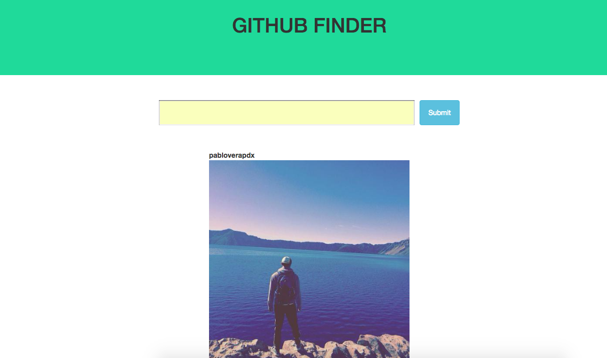

# Epicodus JavaScript, Week 1: Modern JS

### By: Pablo Vera

### Description

This week's code review is a website where a user can go and enter a github user name. Upon submitting the form, the user will be able to see the profile photo and a list of repositories of that user.



### Setup

* Clone this repo on to your desktop. 
* make a .env file on top of your project directory
* Place your github token in the .env file.
* Example: exports.apiKey = "YOURAPIKEYHERE";
 
* Make sure that you have node.js installed in your computer as well as npm, bower, gulp, and SASS globally. 

* In your terminal, run the commands:
```shell
npm install
bower install
gulp build
gulp serve
```
* You should now be able to view the website!

### Technologies Used
* HTML
* CSS
* SCSS
* JavaScript
* jQuery
* Node.js
* bower
* npm
* Gulp
* JSHint
* Browserify
* Bootstrap v3.3.6
