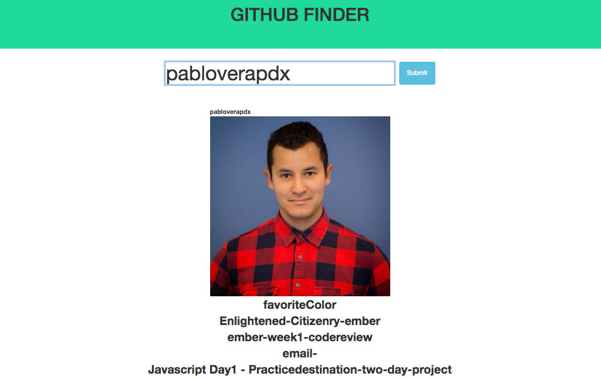

# Epicodus JavaScript, Week 1: Modern JS

### By: Pablo Vera

### Description

This week's code review is a website where a user can go and enter a github user name. Upon submitting the form, the user will be able to see the profile photo and a list of repositories of that user.



### Known Bugs

* No known bugs.

### Setup

Clone this repo on to your desktop, make sure that you have node.js installed on your computer and then:
* navigate into the project folder.
* In your terminal, run the commands:
```shell
npm install
bower install
```
* Once they are finished installing successfully:
```shell
- make a .env file on top of your project directory
- Place your github token/key in .env file
Example: exports.apiKey = "YOURAPIKEYHERE";
gulp build
gulp serve
```
* You should now be able to view the website!

### Technologies Used
* HTML
* CSS
* SCSS
* JavaScript
* jQuery
* Node.js
* bower
* npm
* Gulp
* JSHint
* Browserify
* Bootstrap v3.3.6
